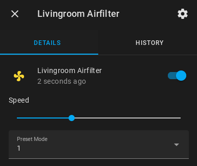
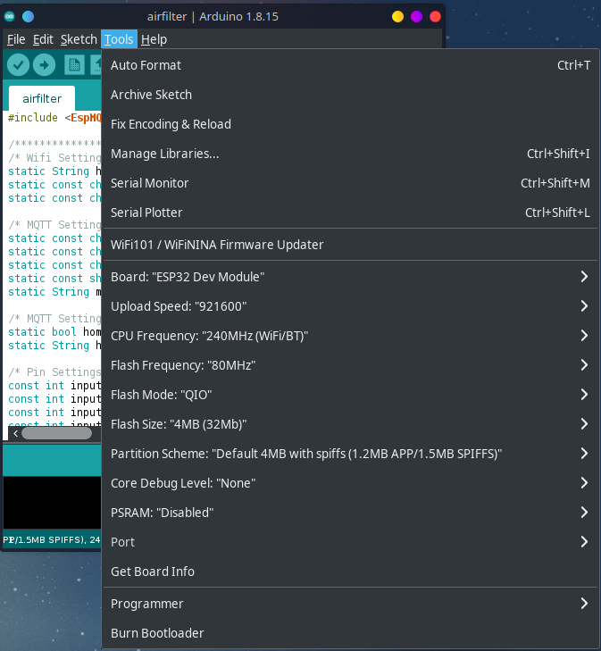
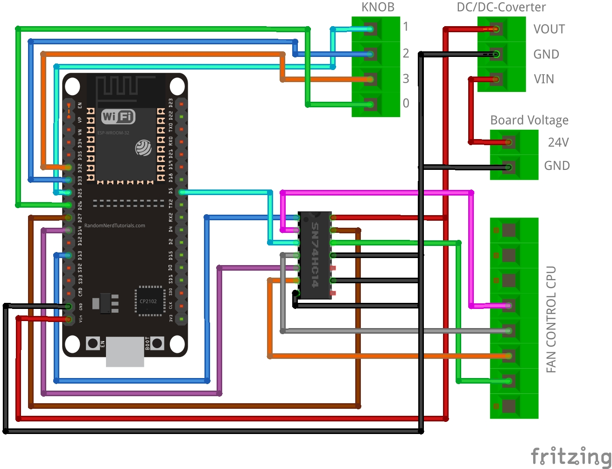
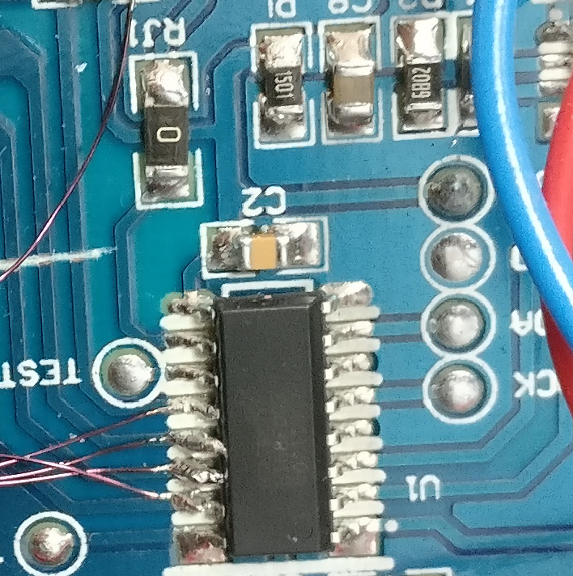
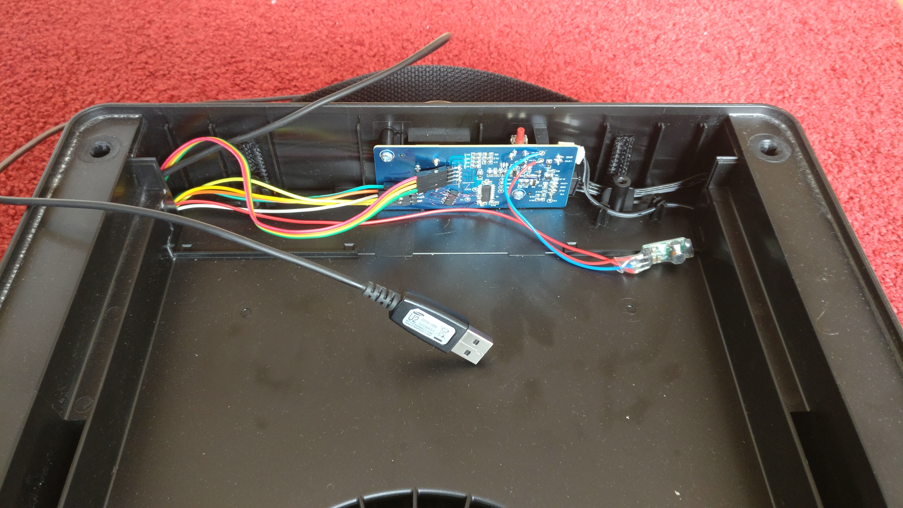

# airfilter
[](https://www.paypal.com/cgi-bin/webscr?cmd=_s-xclick&hosted_button_id=KPG2MY37LCC24&source=url)
[](https://github.com/Schluggi/airfilter/blob/master/LICENSE.txt)

> This is WIP!

I've modified my IKEA Förnuftig to work with Home Assistant. After some ironing you can control the filter via MQTT and
also (!) manual with the knob (as originally intended).
I use an ESP32 NodeMCU but an ESP8266 NodeMCU should also work fine.

Via Home Assistant discovery the air filter will show up there as a fan-entity with three preset modes `1`, `2` and `3`.



## Table of contents (wip)
- [Features]()
- [What you need]()
- [How to]()
  - [Flashing]()
  - [Teardown]()
  - [Soldering]()
- [MQTT]()
- [Home Assistant]()
- [Questions]()
- [Credits]()

## Features
- Control the air filter via MQTT
- Control the air filter manual (as originally intended)
- Home Assistant discovery

## What you need
- ESP32 NodeMCU
- 74C14 or 74HC14 Inverter
- 24V to 5V DC/DC-Converter
- Some Jumper Cables
- Superglue
- Soldering iron
- Tiny wires


## How to
### Flashing
Connect the ESP32 NodeMCU via USB with your pc. On Windows you need some additional drivers. On linux everything should 
work out of the box. 
Start the [Arduino IDE](https://www.arduino.cc/en/software) and open the sketch file located at 
`firmware/airfilter/airfilter.ino`.

Change the WiFi and MQTT settings at the top of the file. Then select your NodeMCU (Tools -> Port) and
configure all settings as shown in the Screenshot below. Afterwards press flash.



### Teardown
Unplug the air filter. 
Remove the blend and the filter. Then lose the two phillips screws at the top and remove the plastic part. Unplug the 
both cables and unscrew the circuit board. You have to also remove the knob before removing the board.

Fortunately IKEA has made a product with a lot of space for make like us - nice. So we can unscrew the six triangle 
screws and the two phillips screws at the bottom. If you don't have a triangle screwdriver: A slot screwdriver will 
work as well. Then remove the two plastic parts. There are clipped, so make sure not to break anything.
(wip, screw image)

### Soldering and wiring
> **Warning:** This step can not be undone!
 
The knob must not have effect on the fan speed directly, so we have to cut the circuit path. I've done this with a 
small cutter.
(wip, img cutting)

The internal DC/DC-Converter is sadly not powerfull enough to power up the ESP32 (sometimes it works, sometimes not).
So we have to use our own Converter to power up the ESP. Just solder the `GND` and `VIN` pins of the DC/DC-Converter to
the 24V output pin on the circuit board. Connect the `GND` and `VOUT` pins of the DC/DC-Converter to the `VIN` and 
`GND` pins of the ESP.

Connecting the inverter is the hardest part because it's tiny. I've soldered the pins as shown below and then superglue 
the converter onto the board. Not great, but good enough.


#### Wiring


This is the fan control CPU. Please mention the origination. 


(wip, img knob connections)

#### Final
> **Caution:** DO NOT USE THIS PHOTO AS REFERENCE! 
> The wiring on this photo looks different from the wiring image because this project
> was learning by doing. So some `GND` and `VCC` wires are connected different.



Now we can connect all cables throw the hole and place the ESP into the perfect fitting space. I also let the usb cable
connected for future firmware updates. 


## MQTT
> **Addition info:** If you turn off the fan by turning the knob to `0` or by sending the `off` payload, the 
> selected preset mode will not change. 

### On and off
#### `airfilter/<hostname>/state`
Returns the state `on` or `off`, while `off` represents knob position 0.

#### `airfilter/<hostname>/set`
Trun the fan on or off by sending `on` or `off` as payload. 

### Presets
#### `airfilter/<hostname>/preset/state`
Returns the current selected preset mode (`1`, `2` or `3`). This equals the knob position. 
Please also notice the *Addition info*.

#### `airfilter/<hostname>/preset/set`
By sending a payload with `0`, `1`, `2` or `3` the fan speed will change like setting the knob to these positions.
`0` will turn off the fan.


## Home Assistant
### Automatic via MQTT discovery (default and recommend)
If you have not disabled MQTT discovery in your Home Assistant instance as well as in the arduino sketch 
(`homeAssistantMqttDiscovery`). The Fan will show up automatically as a fan entity.


### Manually via config
You can also setup the fan entity manually by adding the following yaml to your Home Assistant `configuration.yaml`:
```yaml
fan:
  - platform: mqtt
    name: "<hostname> Airfilter"
    state_topic: "airfilter/<hostname>/state"
    command_topic: "airfilter/<hostname>/set"
    preset_mode_state_topic: "airfilter/<hostname>/preset/state"
    preset_mode_command_topic: "airfilter/<hostname>/preset/set"
    preset_modes:
       -  "1"
       -  "2"
       -  "3"
    payload_on: "on"
    payload_off: "off"
```


## Questions
Just open an issue :)

## Credits 
Created and maintained by Lukas Schulte-Tickmann / Schluggi.